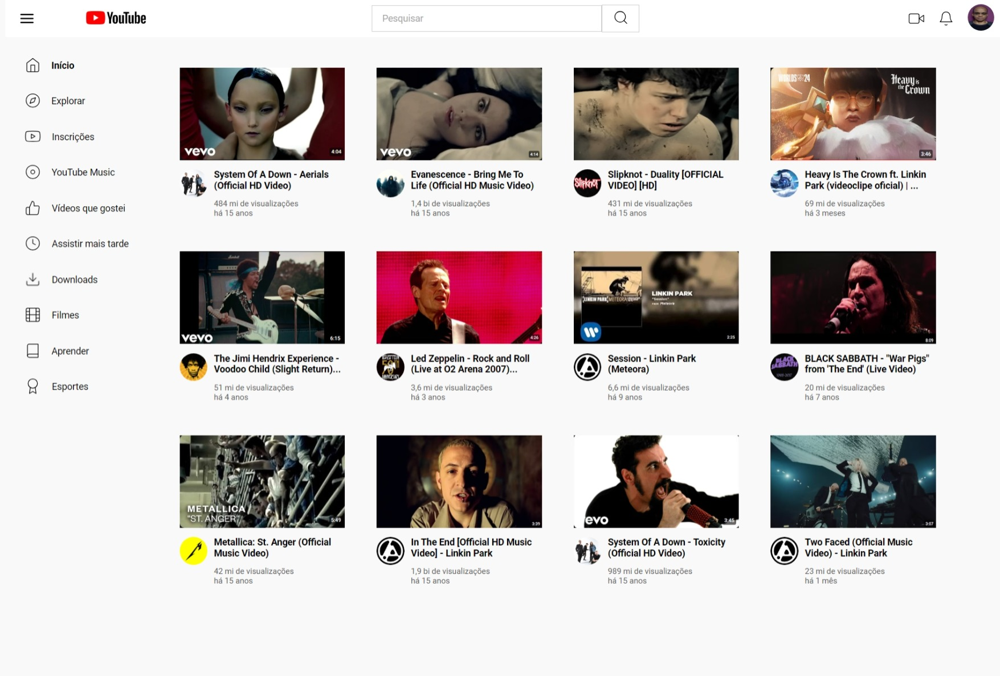

# Clone da Página do YouTube com Grid Layout

## Descrição
Este projeto recria a página inicial do YouTube utilizando **HTML** e **CSS**. O objetivo principal foi consolidar o aprendizado de **Grid Layout**, explorando conceitos como criação de grids bidimensionais e posicionamento de elementos em áreas específicas.

Além disso, durante o desenvolvimento, utilizei os comandos do Git para versionamento e controle do projeto, aplicando na prática os conceitos do módulo **Git & GitHub** do curso da Steph Cardoso, Comunidade Dev Completo.

## 📚 Conteúdo Estudado
O projeto faz parte do módulo **Dominando Grid Layout no CSS**, do curso **Formação CSS Web Developer** da DIO. Os seguintes tópicos foram abordados:
- Conceitos de Grid Layout, Grid Implícito e Explícito;
- Criação e definição de colunas e linhas no grid (`grid-template-columns` e `grid-template-rows`);
- Posicionamento de itens com `grid-area` e alinhamento usando `justify-items`, `justify-content`, `align-items`, `align-content`, `place-items` e `place-content`.

## 🚀 Tecnologias Utilizadas
- **HTML5**: Estruturação dos elementos da página.
- **CSS3**: Estilização e organização dos layouts utilizando **Grid Layout** e **Flexbox**.
- **Git**: Ferramenta para controle de versão de código e a comunicação entre os repositórios remonto, **GItHub**, e local.

## Conceitos Aplicados
### HTML
- Uso de tags semânticas (`header`, `main`, `section`, etc.) para uma estruturação mais acessível e compreensível.
- Implementação de links com a tag `a`, uso da tag `time` para definir a quanto tempo que os videos foram postados, botões com a tag `button`, utilização de `inputs`, `forms` e `placeholder` para criar o campo de pesquisa.

### CSS
- Configuração de grids bidimensionais com `display: grid`.
- Utilização das propriedades `grid-template-columns`, `grid-template-rows`, `gap`, `justify-items` e `align-items`.
- Estilização responsiva e organização visual por meio de **Grid Layout** e **Flexbox**.
- Estilização de textos com fontes personalizadas, cores e tamanhos e dimensionamentos de containers e itens.
- Utilização da unidade de medida `rem` em vez de `px` para deixar os elementos do site mais responsivos.

### Git
- Criação de um repositório local no meu computador e um repositório remoto no GitHub.
- Criação de pastas e arquivos com os comandos `mkdir` e `type null`.
- Adição de arquivos ao repositório com o comando `git add`.
- Comitamento de alterações com o comando `git commit -m`.
- Push das alterações para o repositório remoto com o comando `git push`.
- Transição entre as pastas com o comando `cd`.
- Utilização do comando `git status` para verificar o status do repositório.

## 📸 Resultado Final
